  

  

  

    
    
    
  

---

## 🚀 About Me

- 🧠 I build clean, production-grade **Flutter applications** with strong architecture.
- 🎯 I focus on **smooth UX, maintainable code, and high performance**.
- 🔧 I work across **Flutter, Dart, Firebase, CI/CD, and mobile release pipelines**.
- 🌱 Currently improving **advanced state management + app scalability patterns**.

---

## 🧩 Skills Snapshot

### Languages & Frameworks

  

### Tools & Workflow

  

### Core Strengths

  
  
  
  
  

---

## 📊 GitHub Analytics

  
  

  

---

## 🏆 Highlight Projects

  
  

---

## 🤝 Connect

  
  
  

