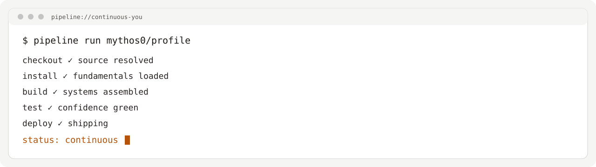
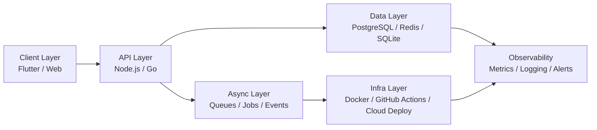
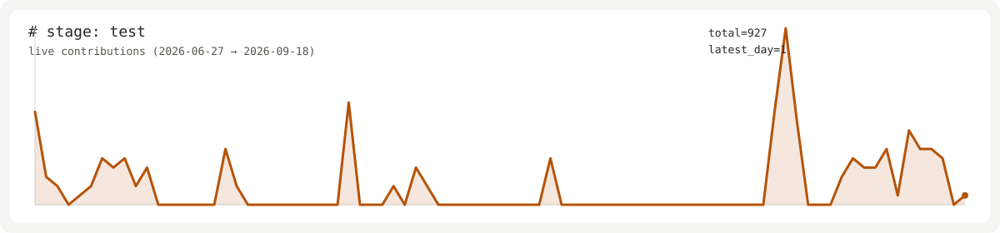

<div align="center">

<picture>
  <source media="(prefers-color-scheme: dark)" srcset="assets/hero-dark.svg">
  
</picture>

</div>

## `# stage: checkout`

```bash
$ whoami --verbose
name            : Mythos
role            : Computer Science Engineer
focus           : Distributed systems, backend architecture, performance-first products
uptime_coding   : still shipping
status          : passing
```

## `# stage: install`

- Dependencies loaded: CS fundamentals, algorithmic problem-solving, and production debugging discipline.
- Built around systems that prioritize correctness, scale, and maintainability.
- Currently finishing final-year CSE work and deepening backend/distributed systems rigor.
- Target environment: software engineering roles with ownership across design, implementation, and delivery.

## `# stage: build`



## `# stage: test`

<picture>
  <source media="(prefers-color-scheme: dark)" srcset="assets/contribution-ekg-dark.svg">
  
</picture>

last_deploy → [`assets/last-deploy.txt`](assets/last-deploy.txt)

## `# stage: deploy`

- **v3.1.0 — Distributed key-value store**  
  Go implementation of replicated key-value primitives with consensus-oriented design.  
  Stack: Go, concurrency primitives, persistence foundations.  
  Repo: https://github.com/mythos0

- **v2.4.0 — Real-time collaboration backend**  
  Event-driven backend patterns for synchronized multi-user editing workflows.  
  Stack: Node.js, WebSockets, CRDT-style sync concepts.  
  Repo: https://github.com/mythos0

- **v1.0.0 — First shipped product**  
  Initial end-to-end project delivered from architecture to release and iteration.  
  Stack: Flutter, Firebase, CI/CD release pipeline.  
  Repo: https://github.com/mythos0

<details>
  <summary>Older releases</summary>

- **v0.9.x — Competitive programming tooling and practice automation**
- **v0.8.x — Early mobile architecture experiments**

</details>

## `# stage: monitor`

```txt
● signal: live
● source: daily GraphQL contribution sync
● mode: stable
```

## `# stage: release`

```txt
tag: v-final-year-2026
role_target: Software Engineer (Backend / Systems)
email: available-on-request
linkedin: https://www.linkedin.com/in/
resume: https://github.com/mythos0
```
